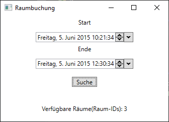

# Raumbuchung
Small room management program that reads dates from a csv-file and allows the user to input a time frame to determine which rooms are available.

Written in C#, WPF
## Look of the gui

A sample input: `Freitag, 5. Juni 2015 10:21:34`

## Sample CSV

The CSV contains and defines the rooms that are available for booking/exist. The sample csv is provided with this repository.

## The Algorithm
Since the csv defines which rooms are available for booking we don't know at the time of looping through the csv which rooms exist. Hence we need two separate lists:
* `roomsReserved` to keep track of which rooms were marked as reserved in the past
  
* `roomsAvailable` to keep track of which rooms were marked as available in the past

Loop through the provided csv and check wether one of the following two cases occur for each dataset:

* userStart falls between the csvStart and csvEnd
  
* csvStart falls between the userStart and userEnd

If one of the above cases occur add the room of the current dataset to the roomsReserved list.

If the room of the current dataset is available add it to the roomsAvailable list.

After looping through all data sets of the csv, remove all reserved rooms from the roomsAvailable list.